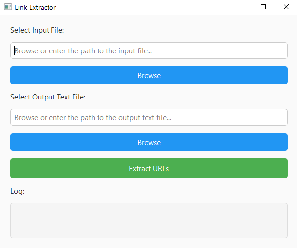

# Link Finder

Link Finder is a Python-based application built with PyQt6 that extracts unique URLs from a variety of file formats. The application supports reading files in CSV, TXT, DOCX, XLSX, SQLite, and other text-readable formats. After extracting the URLs, the app saves them to a specified text file.
#### You can download the Software from the [Releases](https://github.com/Quantlight/Link-Finder/releases/tag/Latest) Panel. No Installation of the Python is needed.
## Screenshot


## Features

- **Extract URLs**: The app can extract URLs from a variety of file types including CSV, TXT, DOCX, XLSX, and SQLite databases.
- **File Support**: Works with common file formats such as `.txt`, `.csv`, `.docx`, `.xlsx`, `.db`, and `.sqlite`.
- **Easy-to-use GUI**: The app has an intuitive interface where you can browse and select the input file and the output location.
- **Unique URLs**: It extracts only unique URLs from the input files and saves them to an output text file.
- **Real-time log**: The application logs the URL extraction progress and displays it in the interface.

## Requirements

To run this application, you'll need the following dependencies:

- Python 3.x
- PyQt6
- `python-docx` for Word document support
- `openpyxl` for Excel file support

### Install the required libraries:

```bash
pip install PyQt6 python-docx openpyxl
